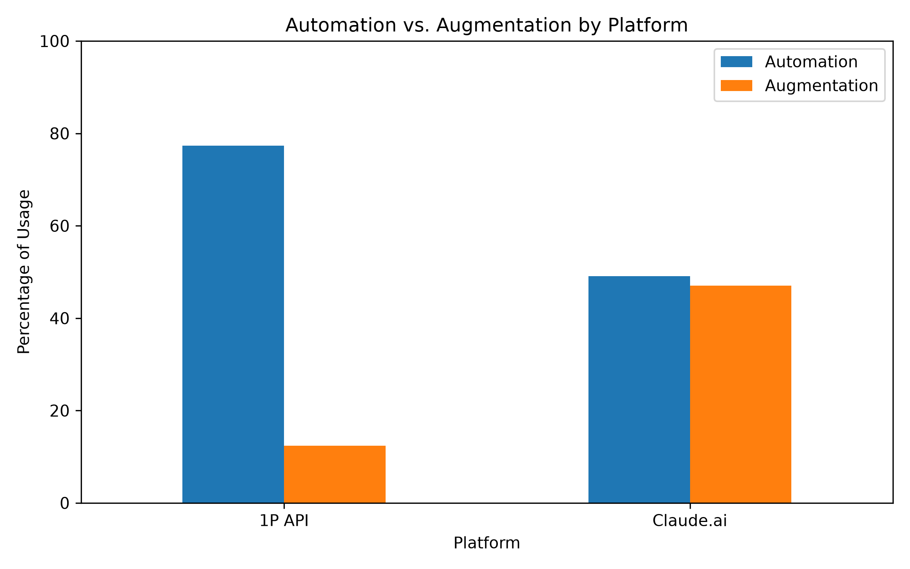
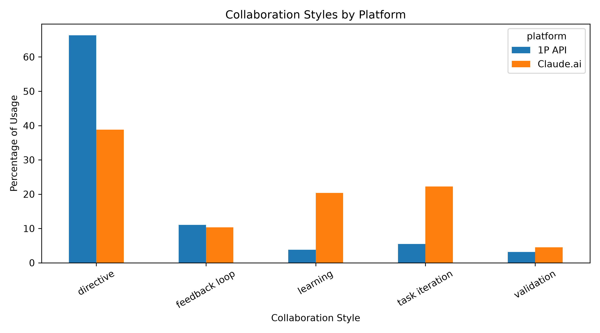
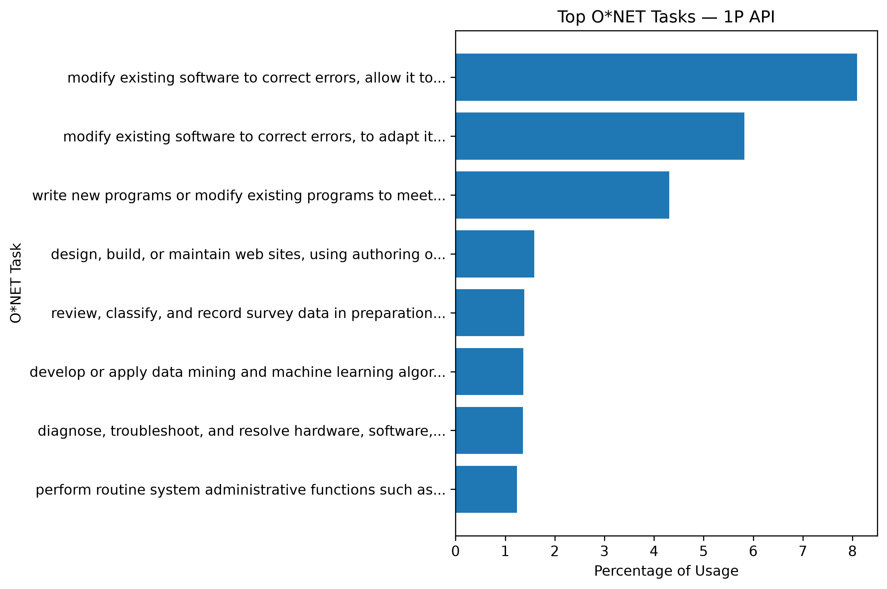
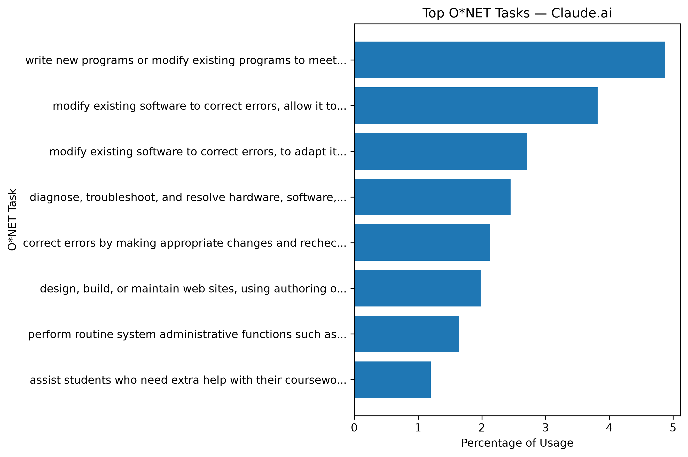

# Dataset Profile

## Anthropic Economic Index — September 2025 Release

This project uses the September 15, 2025 release of the Anthropic Economic
Index. The initial analysis focuses on data collected from August 4 through
August 11, 2025 for first-party API usage and Claude.ai Free and Pro usage.

The first-party API file contains 33,794 rows and the Claude.ai file contains
100,062 rows. Both files contain 10 columns describing the platform,
geography, analysis facet, category, and associated metric value. The released
data are aggregated statistics rather than individual conversations.

The primary variables for this project are the collaboration categories and
O*NET task categories because they allow comparison of how AI is used through 
the enterprise API and consumer-facing Claude.ai product.

## Automation and Augmentation

**Figure 1. Automation vs. augmentation by platform.** First-party API usage
is substantially more automation-oriented than Claude.ai usage. Automation
accounts for approximately 77.37% of API usage compared with 49.10% of
Claude.ai usage. Claude.ai has a much larger augmentation share, at
approximately 47.04%, compared with 12.41% for the API. Automation and
augmentation do not sum to 100% because the `none` and `not_classified`
categories are not included in either group.

## Collaboration Styles

**Figure 2. Individual collaboration styles by platform.** Directive usage is
the largest collaboration category for both platforms but is much more common
for the first-party API. Claude.ai shows considerably larger percentages for
learning and task iteration. These descriptive differences suggest that API
usage is more frequently characterized by task delegation, while Claude.ai
usage more often includes interactive assistance.

## O*NET Task Distribution

**Figure 3. Top classified O*NET tasks for first-party API usage.** The largest
API tasks are heavily concentrated in software-related activities, including
modifying software, programming, website development, machine learning, and
technical troubleshooting. The largest classified task accounts for
approximately 8.10% of API usage.

**Figure 4. Top classified O*NET tasks for Claude.ai usage.** Software-related
tasks are also prominent in Claude.ai usage. The largest classified task,
writing or modifying programs to meet customer requirements, accounts for
approximately 4.87% of usage. The top Claude.ai tasks are somewhat less
concentrated than the API tasks and also include an education-related task.

## Initial Observations

The preliminary profile shows a substantial descriptive difference in
collaboration style between the two platforms. First-party API usage has an
automation share approximately 28.27 percentage points higher than Claude.ai.
At the same time, software-related work is prominent on both platforms.
